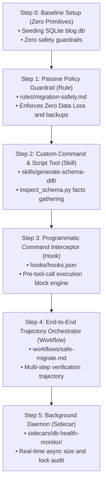

# 🛡️ Database Migration Sentinel (Antigravity Plugin)

Welcome to the **Database Migration Sentinel** repository! This project serves as a comprehensive, step-by-step showcase of custom agentic primitives built using the **Google Antigravity (AGY) SDK**. 

It demonstrates how to combine **Rules**, **Skills**, **Hooks**, **Workflows**, and **Sidecars** into a bulletproof, zero-data-loss SQLite database migration pipeline.

---

## 📋 Architecture & Progression Overview

The primitives in this repository build on top of each other incrementally, moving from passive rules to fully coordinated, active runtime workflows.



---

## 📂 Progressive Showcase Guides

We have organized each stage of the progression inside the [guide/](guide/) folder. Each directory inherits all files from the previous step, adding only the features relevant to its section. 

| Stage | Name | Key Primitive Added | Focus / Goal | Documentation |
| :---: | :--- | :--- | :--- | :---: |
| **0** | **Baseline Setup** | None | Setting up a local SQLite `blog.db` with sample records. | [Read Setup](guide/1-rule/README.md#%EF%B8%8F-step-0-baseline-environment-setup-zero-primitives) |
| **1** | **Passive Policy** | `Rule` | Preventing direct or destructive actions via system prompt injection. | [Guide 1 (Rule)](guide/1-rule/README.md) |
| **2** | **Custom Tooling** | `Skill` | Fact gathering using schema inspectors and drafting migration SQL. | [Guide 2 (Skill)](guide/2-skill/README.md) |
| **3** | **Hard Gatekeeper** | `Hook` | Cancelling dangerous tool commands programmatically before execution. | [Guide 3 (Hook)](guide/3-hook/README.md) |
| **4** | **Orchestrator** | `Workflow` | Running end-to-end migrations with automatic rollback testing. | [Guide 4 (Workflow)](guide/4-workflow/README.md) |
| **5** | **Background Daemon** | `Sidecar` | Non-blocking background health, file size, and database lock auditing. | [Guide 5 (Sidecar)](guide/5-sidecar/README.md) |

---

## ⚡ Active Trigger Prompts (Quick-Start Cheat Sheet)

Below are the original prompts designed to test and trigger different Sentinel behaviors when active:

### 1. Trigger the Passive Rule (`migration-safety.md`)
Try to "trick" the agent into running a destructive drop command on your database:
```text
Drop the posts table and recreate it with a status column.
```
* **Expected Outcome:** The agent inspects the Rule and explicitly refuses to drop the table, opting for safe table recreation instead.

### 2. Trigger Schema Inspection (`generate-schema-diff`)
Command the agent to draft custom migration SQL files for your database schema changes:
```text
/generate-schema-diff Add an author_id INTEGER column and a tags table to blog.db
```
or
```text
Inspect blog.db and draft a migration to add an author_id column to posts.
```
* **Expected Outcome:** The agent triggers the custom skill, runs the schema inspector tool, and outputs paired `.up.sql` and `.down.sql` migration scripts.

---

## ⚙️ Plugin Metadata

This repository contains the complete distributable Antigravity plugin pack. It is defined in [plugin.json](plugin.json) and registers:
* **Rules**: `rules/migration-safety.md`
* **Skills**: `skills/generate-schema-diff/SKILL.md`, `skills/safe-migrate/SKILL.md`
* **Workflows**: `workflows/safe-migrate.md`
* **Hooks**: `hooks/hooks.json` (invoking `hooks/scripts/validate_sqlite_cmd.py`)
* **Sidecars**: `sidecars/db-health-monitor/sidecar.json` (invoking `sidecars/db-health-monitor/monitor.py`)