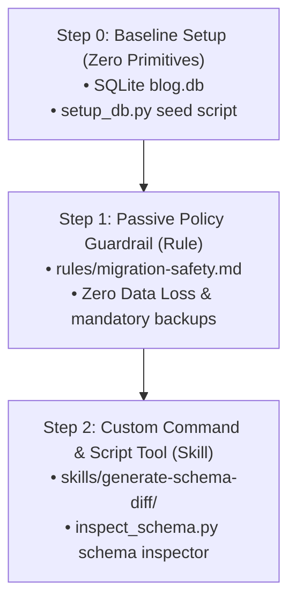

# Step 2: Custom Command & Script Tool (Skill)

This section demonstrates how to teach an agent new operational capabilities by adding **Skills**. Skills combine high-level procedural instructions with executable scripts to solve specific technical challenges.

---

## 📋 Progression Overview



---

## 🛠️ Step 2: Custom Command & Script Tool (Skill)

While the passive Rule prevents the agent from making destructive changes, it does not explicitly teach the agent how to gather schema facts or construct precise, safe schema changes. We solve this by equipping the agent with **Primitive #2 — Skill**.

### 🎯 Goal
Teach the agent how to inspect SQLite schemas programmatically and draft paired, non-destructive migration scripts (`*.up.sql` and `*.down.sql`).

### 🔧 Build
This step inherits everything from **Step 1** (including `.agents/rules/migration-safety.md` and `setup_db.py`) and adds:
- `.agents/skills/generate-schema-diff/SKILL.md`: Instructs the agent on how to use the bundled python script to extract existing schema facts.
- `.agents/skills/generate-schema-diff/scripts/inspect_schema.py`: A Python tool that queries `sqlite_master` and table metadata, outputting a clean JSON representation of database tables and columns.
- `.agents/manifest.json`: Registers the `generate-schema-diff` skill in the workspace.

---

## 🧪 Test & Showcase

This primitive can be validated at two separate levels: the command-line interface (CLI) level and the conversational agent level.

### 1. CLI Level Test
Run the schema inspection script directly on your machine to verify that it outputs correctly structured schema information.

```bash
# First, ensure you have set up the baseline database
python3 setup_db.py

# Run the inspect helper script
python3 .agents/skills/generate-schema-diff/scripts/inspect_schema.py blog.db
```

> [!NOTE]
> **Expected Output:**
> ```json
> {
>   "posts": [
>     {
>       "cid": 0,
>       "name": "id",
>       "type": "INTEGER",
>       "notnull": false,
>       "dflt_value": null,
>       "pk": true
>     },
>     {
>       "cid": 1,
>       "name": "title",
>       "type": "TEXT",
>       "notnull": true,
>       "dflt_value": null,
>       "pk": false
>     },
>     {
>       "cid": 2,
>       "name": "body",
>       "type": "TEXT",
>       "notnull": true,
>       "dflt_value": null,
>       "pk": false
>     },
>     {
>       "cid": 3,
>       "name": "created_at",
>       "type": "TIMESTAMP",
>       "notnull": false,
>       "dflt_value": "CURRENT_TIMESTAMP",
>       "pk": false
>     }
>   ]
> }
> ```

---

### 2. Agent Level Test
In the agent chat, invoke the `/generate-schema-diff` skill with a request for schema modification.

```text
/generate-schema-diff Add a status column to blog.db
```

> [!TIP]
> **Expected Agent Behavior:**
> 1. The agent notices the slash command `/generate-schema-diff` and executes the skill instructions defined in `SKILL.md`.
> 2. It runs the helper script `.agents/skills/generate-schema-diff/scripts/inspect_schema.py blog.db` to discover the schema.
> 3. Following the safety Rules from Step 1, it crafts two paired files under `migrations/`:
>    - `001_add_status.up.sql`: Safely recreates the posts table (with a default `'draft'` value for the new `NOT NULL` status column, preserving existing row data as mandated by the Rule).
>    - `001_add_status.down.sql`: Safely rolls back the change, returning the table back to the original schema without data loss.
