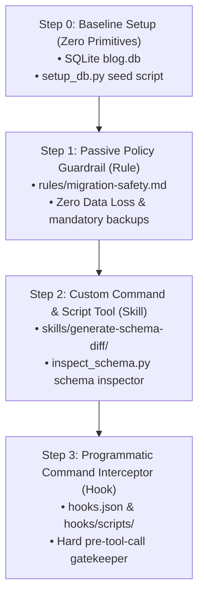

# Step 3: Programmatic Command Interceptor (Hook)

This section demonstrates how to introduce hard security boundaries using **Programmatic Command Interceptors (Hooks)**. Hooks intercept agent actions *before* they are sent to the operating system or executed, allowing programmatic approval, modification, or cancellation of actions.

---

## 📋 Progression Overview



---

## 🛠️ Step 3: Programmatic Command Interceptor (Hook)

While Rules provide passive guidance (system prompts), highly capable or creative LLMs can sometimes find ways to bypass system instructions. To guarantee safety, we add **Primitive #3 — Hook**. A Hook acts as a hard programmatic firewall built into the agent runtime.

### 🎯 Goal
Create a hard programmatic gatekeeper that inspects and cancels dangerous command-line executions (e.g. database operations without safety backups, direct unscripted drops, or migrations missing rollback scripts) before execution.

### 🔧 Build
This step inherits everything from **Step 2** (Rules, Skills, `setup_db.py`) and adds:
- `.agents/hooks.json`: Declares a `pre-tool-call` hook event listener for any `bash` tool call containing `sqlite3` and `blog.db`.
- `.agents/hooks/scripts/validate_sqlite_cmd.py`: The validation engine written in Python that:
  1. Denies command execution if a write/modification statement is attempted and `blog.db.bak` does not exist.
  2. Denies raw CLI-level `DROP TABLE` statements (only allows them inside `.sql` migration scripts).
  3. Denies executing a `.up.sql` migration script if a matching `.down.sql` rollback script is missing.

---

## 🧪 Test & Showcase

### 1. CLI Level Test
We can verify the interceptor logic by mimicking the JSON payload sent by the Antigravity runtime and piping it into our hook script.

```bash
# Test Case A: Simulate a write command while 'blog.db.bak' is missing
# (Ensure blog.db.bak does not exist in your directory first)
rm -f blog.db.bak

echo '{"tool_input": {"command": "sqlite3 blog.db \"ALTER TABLE posts ADD COLUMN test TEXT;\""}}' | python3 .agents/hooks/scripts/validate_sqlite_cmd.py
```

> [!NOTE]
> **Expected Output (Blocked):**
> ```json
> {
>   "decision": "deny",
>   "reason": "[HOOK BLOCKED] Missing safety backup! 'blog.db.bak' does not exist. You must create a backup copy using 'cp blog.db blog.db.bak' before executing database modifications."
> }
> ```

```bash
# Test Case B: Create the backup and try again
touch blog.db.bak

echo '{"tool_input": {"command": "sqlite3 blog.db \"ALTER TABLE posts ADD COLUMN test TEXT;\""}}' | python3 .agents/hooks/scripts/validate_sqlite_cmd.py
```

> [!NOTE]
> **Expected Output (Approved):**
> ```json
> {
>   "decision": "approve"
> }
> ```

---

### 2. Agent Level Test
To showcase this live in the agent chat trace:

1. In your workspace, delete the backup file:
   ```bash
   rm -f blog.db.bak
   ```
2. In the chat, explicitly command the agent to run a raw sqlite3 query to add a column:
   ```text
   Run a raw sqlite3 bash command to add a text column 'test_col' to the posts table.
   ```

> [!CAUTION]
> **Expected Agent Behavior:**
> 1. The agent tries to perform the bash command `sqlite3 blog.db ...`.
> 2. The Hook triggers on the `pre-tool-call` event, runs `validate_sqlite_cmd.py`, and returns `deny` back to the runtime along with the warning message.
> 3. In the chat trace, you will see the bash command fail instantly due to the Hook block.
> 4. The agent will read the Hook block's reason, apologize, run `cp blog.db blog.db.bak` first, and only then retry the schema change.
