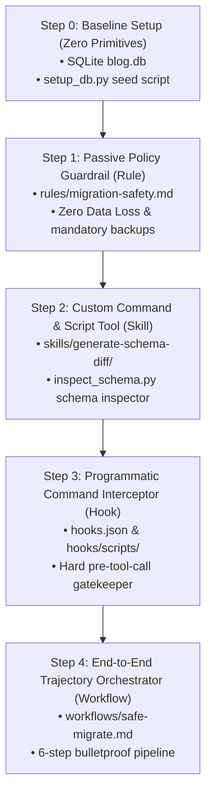

# Step 4: End-to-End Trajectory Orchestrator (Workflow)

This section demonstrates how to coordinate rules, skills, and hooks into a unified, multi-step sequence using **Workflows**. Workflows define rigid, reliable execution paths for complex operations like database migrations.

---

## 📋 Progression Overview



---

## 🛠️ Step 4: End-to-End Trajectory Orchestrator (Workflow)

While Rules, Skills, and Hooks ensure safe isolated actions, complex tasks like database migrations require multiple dependent steps (e.g. creating backups, inspecting schemas, generating code, running migrations, verifying data integrity, and verifying rollback safety). We automate this using **Primitive #4 — Workflow**.

### 🎯 Goal
Automate the entire database migration trajectory from start to finish with guaranteed correctness, ensuring that migrations are safe, reversible, and preserve all data before final application.

### 🔧 Build
This step inherits everything from **Step 3** (Rules, Skills, Hooks, `setup_db.py`) and adds:
- `.agents/workflows/safe-migrate.md`: Defines the precise 6-step trajectory:
  1. **Draft**: Run `/generate-schema-diff` to generate `.up.sql` and `.down.sql` scripts.
  2. **Backup**: Check for and verify `blog.db.bak`.
  3. **Count Check**: Record row counts before migration to establish a baseline.
  4. **Apply UP**: Execute the drafted `.up.sql` upgrade script.
  5. **Test Rollback DOWN**: Execute the `.down.sql` rollback script, verify row counts match the baseline, and then re-apply `.up.sql`.
  6. **Summary Report**: Confirm the final row count and display the final schema to the user.
- `.agents/skills/safe-migrate/SKILL.md`: Registers a skill wrapper so the workflow can be triggered easily using slash-command autocompletion in chat.
- `.agents/manifest.json`: Registers both `generate-schema-diff` and `safe-migrate` skills.

---

## 🧪 Test & Showcase

### 1. Agent Level Test
To run this orchestrated pipeline:
1. Open the agent chat.
2. Trigger the workflow using the slash command `/safe-migrate` with your schema changes:
   ```text
   /safe-migrate Add author, status, and tags to blog.db
   ```

> [!TIP]
> **Expected Agent Behavior:**
> Watch the agent's step-by-step reasoning in the chat logs:
> - **Step 1:** The agent executes `/generate-schema-diff` and drafts `002_add_author_status_tags.up.sql` and `002_add_author_status_tags.down.sql` inside the `migrations/` directory.
> - **Step 2:** The agent ensures a backup `blog.db.bak` exists before making modifications.
> - **Step 3:** The agent queries `SELECT COUNT(*) FROM posts;` (printing `PRE_COUNT: 3`).
> - **Step 4:** The agent applies `002_add_author_status_tags.up.sql` to `blog.db`.
> - **Step 5 (Live Verification):** The agent runs `002_add_author_status_tags.down.sql` to roll back the database, runs a row count query (verifying count is still `3`), and then re-applies `002_add_author_status_tags.up.sql`.
> - **Step 6:** The agent outputs a final verification report confirming the migration completed successfully with zero data loss!
