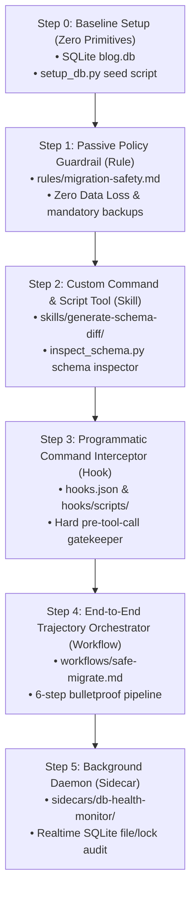

# Step 5: Background Daemon (Sidecar)

This section demonstrates how to introduce asynchronous background processing using **Sidecars**. Sidecars run continuous background daemons parallel to the main conversation thread to audit system health, monitor logs, or fetch external states without blocking user interactions.

---

## 📋 Progression Overview



---

## 🛠️ Step 5: Background Daemon (Sidecar)

While Rules, Skills, Hooks, and Workflows provide safety and orchestration for active conversational queries, they cannot run asynchronously in the background when the agent is idle. To continuously audit the database and detect issues (such as abnormal file growth, WAL-log bloating, or deadlocks), we introduce **Primitive #5 — Sidecar**.

### 🎯 Goal
Monitor system health asynchronously in the background and report status alerts without blocking the conversational agent.

### 🔧 Build
This step inherits everything from **Step 4** (Rules, Skills, Hooks, Workflows, `setup_db.py`) and adds:
- `.agents/sidecars/db-health-monitor/sidecar.json`: Defines the sidecar's unique ID, friendly name, description, execution entrypoint, and trigger interval (5 seconds).
- `.agents/sidecars/db-health-monitor/monitor.py`: A Python background daemon that executes every 5 seconds to inspect:
  1. **Database size**: Warns if `blog.db` exceeds 50MB.
  2. **WAL log growth**: Warns if Write-Ahead Logs (`blog.db-wal`) grow beyond 10MB, suggesting a checkpoint operation.
  3. **Database locks**: Validates query responsiveness and warns of connection lock issues.
  Outputs status updates to `.agent/runtime/sidecar_alerts.json`.

---

## 🧪 Test & Showcase

### 1. CLI Level Test
We can execute the monitor script directly from the terminal to verify that it audits database metrics correctly and writes files to the target runtime path.

```bash
# First, ensure you have set up the baseline database
python3 setup_db.py

# Run the monitor script once to generate the status file
python3 .agents/sidecars/db-health-monitor/monitor.py
```

Now, check the generated health report file in another terminal window or cancel the monitor script (Ctrl+C) and inspect:

```bash
cat .agent/runtime/sidecar_alerts.json
```

> [!NOTE]
> **Expected Output:**
> ```json
> {
>   "timestamp": 1718876400.123456,
>   "alerts": []
> }
> ```
> *(Note: alerts will be empty since the database file is small and healthy).*

---

### 2. Live Runtime Test
To showcase how the Sidecar works continuously:
1. In the agent chat, you can proceed with standard conversational requests.
2. In the background, the Antigravity framework spawns `python3 monitor.py` which continually writes to `.agent/runtime/sidecar_alerts.json`.
3. If an event occurs that locks the database (e.g. a separate process begins a long-running write transaction without committing), the sidecar will write a database lock alert:
   ```json
   {
     "level": "ERROR",
     "msg": "Database lock detected: database is locked"
   }
   ```
4. The Antigravity main loop will automatically read this state file at the beginning of the next conversation turn, warning the agent of the database locks before any tool is executed.
